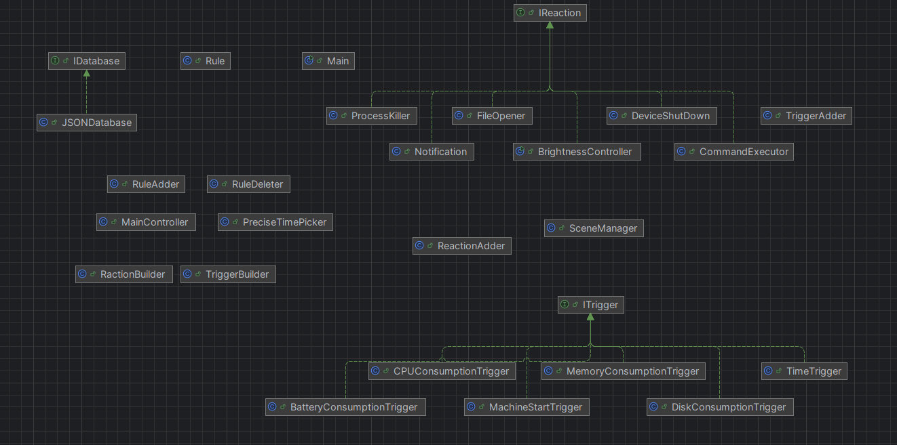

```aiignore
the project was made on the idea of the relation between triggers and reactions 

# class diagram


```
- there is no specific design pattern followed with this project
- every trigger implements the ITrigger interface and the same thing with reactions

# GUI
- builders are used to get a valid trigger or reaction 
- a scene manager is used to handel basic operations about GUI 
